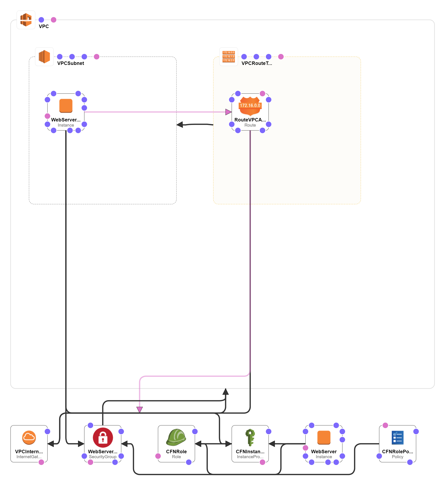
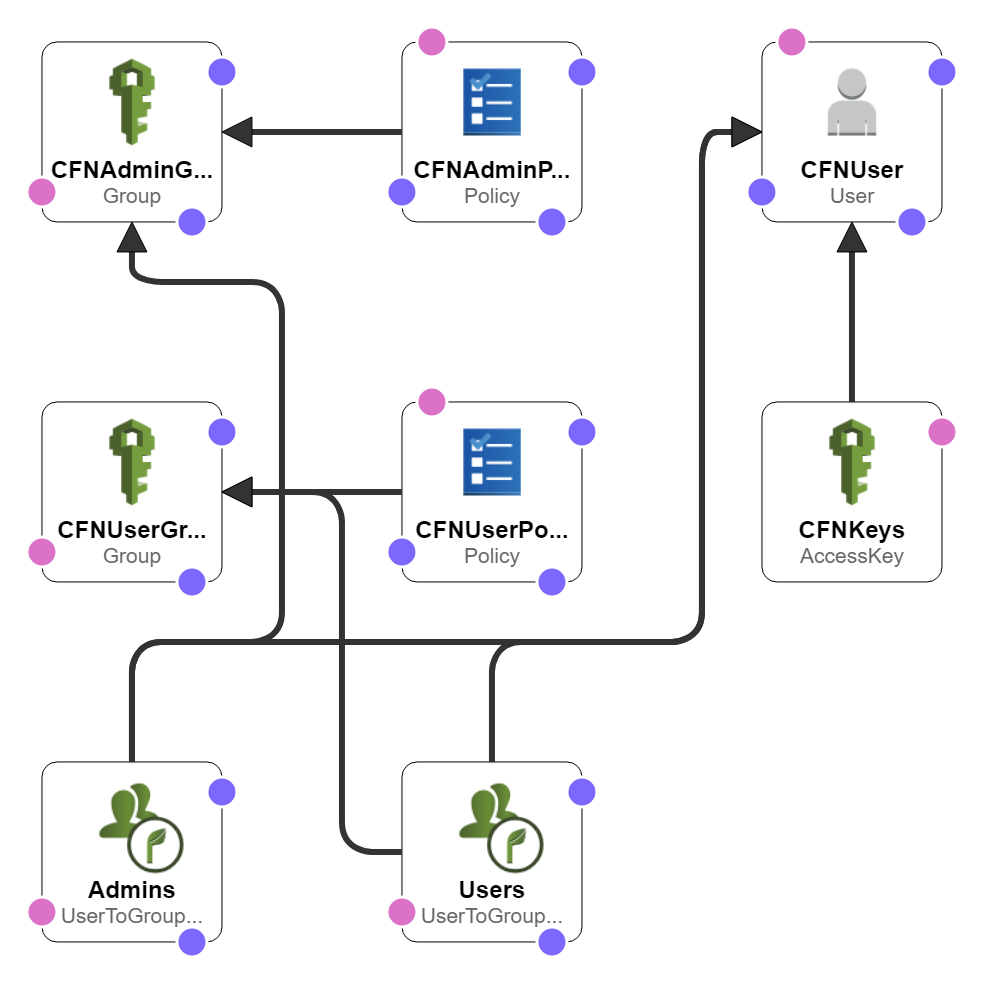
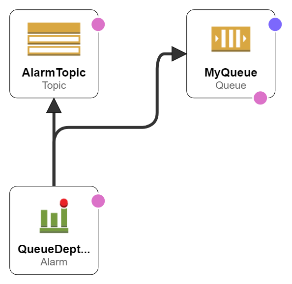
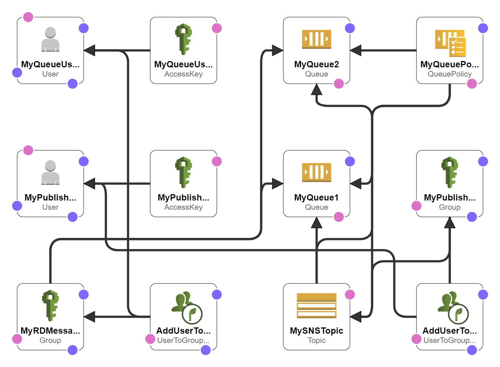

# Awesome AWS CloudFormation

Templates for spawning up / deploying your AWS resources

|Img|Category / Designer|JSON|Links|
|---|---|---|---|
||[Generator](https://docs.aws.amazon.com/AWSCloudFormation/latest/UserGuide/cfn-using-cloudformer.html) / CloudFormer|[CloudFormer-EC2-t2.medium](assets/config/template-CloudFormer-EC2-t2.medium.yaml)|[CloudFormation Templates](https://aws.amazon.com/cloudformation/aws-cloudformation-templates/)|
||Auto Scaling /|||
||Batch /|||
||Config / |||
||DynamoDB /|||
||EC2 /|||
||ElastiCache /|||
||Elastic Beanstalk /|||
||Elastic Load Balancing (ELB) /|||
||Identity and Access Management (IAM) / [IAM users and groups](https://console.aws.amazon.com/cloudformation/designer/home?region=us-west-2&templateURL=https://s3-us-west-2.amazonaws.com/cloudformation-templates-us-west-2/IAM_Users_Groups_and_Policies.template)|[IAM1.template](https://s3-us-west-2.amazonaws.com/cloudformation-templates-us-west-2/IAM_Users_Groups_and_Policies.template)||
||OpsWorks /|||
||Relational Database Service (RDS) /|||
||Redshift /|||
||Route 53 /|||
||Simple Storage Service (S3) /|||
||Simple Queue Service (SQS) / [SQS With CloudWatch Alarms](https://console.aws.amazon.com/cloudformation/designer/home?region=us-west-2&templateURL=https://s3-us-west-2.amazonaws.com/cloudformation-templates-us-west-2/SQS_With_CloudWatch_Alarms.template)|[SQS_With_CloudWatch_Alarms.template](https://s3-us-west-2.amazonaws.com/cloudformation-templates-us-west-2/SQS_With_CloudWatch_Alarms.template)||
||Simple Queue Service (SQS) / [SNS topic that sends messages to SQS queues](https://console.aws.amazon.com/cloudformation/designer/home?region=us-west-2&templateURL=https://s3-us-west-2.amazonaws.com/cloudformation-templates-us-west-2/SNSToSQS.template)|[SNSToSQS.template](https://s3-us-west-2.amazonaws.com/cloudformation-templates-us-west-2/SNSToSQS.template)||
||Virtual Private Cloud (VPC) /|||

# Links

* [AWS CloudFormation Services](https://docs.aws.amazon.com/AWSCloudFormation/latest/UserGuide/sample-templates-services-us-west-2.html)

The End
